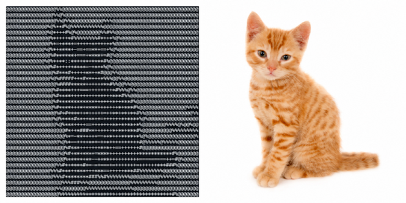

# asciiclaw 🦀

[](https://www.npmjs.com/package/asciiclaw)

Convert images to ASCII art in the terminal.

<p align="center">
  
</p>

`asciiclaw` takes any PNG, JPG, WebP, or GIF and renders it as ASCII art directly in your terminal. Auto-fits to your terminal size. Three character ramps, manual width/height override, invert mode, and file output.

## What It Does

- converts PNG, JPG, WebP, and GIF to ASCII art
- auto-detects terminal size: no flags needed for a full-screen render
- three character ramps: classic, blocks, dense
- manual width and height override
- invert mode for light-on-dark terminals
- write output to file with `--output`
- pipe-friendly: output goes to stdout by default

## Requirements

- Node 22+

For development: pnpm

## Install

[asciiclaw on npm](https://www.npmjs.com/package/asciiclaw)

```bash
npm install -g asciiclaw
```

Or clone and build from source:

```bash
git clone https://github.com/psandis/asciiclaw.git
cd asciiclaw
pnpm install
pnpm build
```

## Quick Start

```bash
ascii images/cat1.jpg
```

No flags needed. Auto-detects your terminal size and fills it. You can also use the full command name `asciiclaw`.

## Demo

```
ascii images/cat1.jpg --width 65 --height 32
```

```
@@@@@@@@@@@@@@@@@%%@@@@@@@@@@@@@@@@@@@@@@@@@@@@@@@@@@@@@@@@@@@@@@
@@@@@@@@@@@@@@@@%%@%@@@@@@@@@@@@@@@@@@@@@@@@@@@@@@@@@@@@@@@@@@@@@
@@@@@@@@@@@@@@@@@%%@%%@@@@@@@@@@@%%%@@@@@@@@@@@@@@@@@@@@@@@@@@@@@
@@@@@@@@@@@@@@%@%**#%@%%%%%%%%%%%@@@@@@@@@@@@@@@@@@@@@@@@@@@@@@@@
@@@@@@@@@@@@@@%@*+++#%@%@@@@@@@@%%#%%@@@@@@@@@@@@@@@@@@@@@@@@@@@@
@@@@@@@@@@@@@@@%*++++*#%%%%%%%%#*++*%@%@@@@@@@@@@@@@@@@@@@@@@@@@@
@@@@@@@@@@@@@@@%*=+***+=+++++*+++++*%@@@@@@@@@@@@@@@@@@@@@@@@@@@@
@@@@@@@@@@@@@%@%*+****+-==+==**+==+%@%@@@@@@@@@@@@@@@@@@@@@@@@@@@
@@@@@@@@@@@@@@@%#******+===+****+=#@%@@@@@@@@@@@@@@@@@@@@@@@@@@@@
@@@@@@@@@@@@@%@%*+**::**++**+****#%@@@@@@@@@@@@@@@@@@@@@@@@@@@@@@
@@@@@@@@@@@@@@@%#*+++++****=-+*+*%@%@@@@@@@@@@@@@@@@@@@@@@@@@@@@@
@@@@@@@@@@@@@@@@%#***#+++++**++*#@@@%%@@@@@@@@@@@@@@@@@@@@@@@@@@@
@@@@@@@@@@@@@@@%@%#####++*#**+++*%%%@@%%@@@@@@@@@@@@@@@@@@@@@@@@@
@@@@@@@@@@@@@@@@@%####*****++++++**#%%@@%%@@@@@@@@@@@@@@@@@@@@@@@
@@@@@@@@@@@@@@@@%#****+++===++++++++*#%%%@%%@@@@@@@@@@@@@@@@@@@@@
@@@@@@@@@@@@@@@@%#****++++++++++++++***#%%@@@@@@@@@@@@@@@@@@@@@@@
@@@@@@@@@@@@@@@@%#************++++++*++***#%@@@@@@@@@@@@@@@@@@@@@
@@@@@@@@@@@@@@@@%#****+++*+****+++++++*+***#%@@@@@@@@@@@@@@@@%%%%
@@@@@@@@@@@@@@@@@%#*#****++*+++++=++**+**+**#%%@@@@@@@@@@@@@@@@%%
@@@@@@@@@@@@@@@@%@%****#**++**++=++++++*+****%@%@@@@@@@@@@@@@@@@@
@@@@@@@@@@@@@@@@@%@%***++++==+++++++**+*+**+*%@@@@@@@@%%%%@%@@%@@
@@@@@@@@@@@@@@@@@@@@#*++*###**++++++*+**+***#%@@@@@@@@@@%%%%%%%%%
@@@@@@@@@@@@@@@@@@@@%*=-**+++++==++*+++*+**+*%@%@@@@@@@@@@@@@@@@%
@@@@@@@@@@@@@@@@@@%@%*==++++**+=++*++++++++++#@%%%%%@%%%%%@@@@@@@
@@@@@@@@@@@@@@@@@@@@%#***+++++++*+*++==++++++#@@@@@@@@@@@@@@@@@@@
@@@@@@@@@@@@@@@@@@%@%#+**+***+=****++++++++++***********#%@@@@@@@
@@@@@@@@@@@@@@@@@@@@%*****+**--++**++++++++++=========++=#@%@@@@@
@@@@@@@@@@@@@@@@@%%#*+****#*=-=+===+=+++++++=++++++***###%@@@@@@@
@@@@@@@@@@@@@@@%%%#***++***+++***==+++++***##%%%%%%%%@@@@@@@@@@@@
@@@@@@@@@@@@@@@@%%%#********###%%#%%%%%%%%@@@@@@@@@@%%%%%%@@@@@@@
@@@@@@@@@@@@@@@@@@@%%%###%%%@@@@@@@@@@@@@@%%%%%%%%%@@@@@@@@@@@@@@
@@@@@@@@@@@@@@@@@%%@@@@@@@@%%%%%%%%%%%%%%%%@@@@@@@@@@@@@@@@@@@@@@
```

## CLI Options

```
ascii <image> [options]
asciiclaw <image> [options]
```

Run `ascii --help` at any time to see the full option list in your terminal.

| Option | Short | Default | Description |
|--------|-------|---------|-------------|
| `--width <number>` | `-w` | terminal columns | Output width in characters. Each character = one pixel column. |
| `--height <number>` | `-H` | derived from aspect ratio | Output height in characters. Each character = one pixel row. |
| `--ramp <name>` | `-r` | `classic` | Character ramp: `classic`, `blocks`, or `dense`. Controls which characters represent brightness levels. |
| `--invert` | `-i` | off | Invert brightness mapping. Dark pixels become light characters and vice versa. Use for images with dark backgrounds. |
| `--output <file>` | `-o` | stdout | Write ASCII output to a file instead of printing to the terminal. |
| `--version` | `-V` | | Print the version number and exit. |
| `--help` | `-h` | | Show all available options and exit. |

## Sizing

Each pixel in the resized image maps to exactly one character. The output dimensions control how many pixels the image is scaled to.

| Mode | Command | Behavior |
|------|---------|----------|
| Auto | `ascii image.jpg` | Width = terminal columns, height = aspect ratio, capped at terminal rows |
| Width only | `ascii image.jpg --width 80` | Height derived from aspect ratio, capped at terminal rows |
| Height only | `ascii image.jpg --height 40` | Width derived from aspect ratio, capped at terminal columns |
| Both | `ascii image.jpg --width 80 --height 40` | Exact dimensions, image stretched to fit |

### Character Aspect Ratio

Terminal characters are approximately 2x taller than wide in pixels. Without correction, a square image at `--width 80` would produce 80 rows and look twice as tall. The auto-calculated height divides by 2, so a square image at `--width 80` produces 40 rows and looks visually square in the terminal. When you set `--height` manually this correction is not applied.

## Ramps

| Ramp | Characters | Best for |
|------|-----------|----------|
| `classic` | `@%#*+=-:. ` | general use, photos |
| `blocks` | `█▓▒░ ` | bold, high contrast |
| `dense` | full printable ASCII set | maximum detail |

Dark pixels map to dense characters (`@`, `%`, `#`). Bright pixels map to light characters (`.`, space). Use `--invert` to flip this for images with dark backgrounds.

## File Structure

```
asciiclaw/
├── src/
│   ├── index.ts              # CLI entry point
│   ├── convert.ts            # image-to-ASCII core
│   └── ramps.ts              # character ramp definitions
├── tests/
│   ├── images/
│   │   └── gradient.png      # synthetic test fixture
│   └── convert.test.ts
├── images/
│   ├── cat1.jpg
│   └── dog-puppy.png
├── scripts/
│   └── generate-fixtures.mjs
├── assets/
│   ├── asciiclaw.png         # header image
│   ├── cat1-ascii.png
│   └── cat1-original.png
├── .gitignore
├── .node-version
├── LICENSE
├── README.md
├── biome.json
├── package.json
├── pnpm-lock.yaml
├── tsup.config.ts
└── tsconfig.json
```

## Development

```bash
git clone https://github.com/psandis/asciiclaw.git
cd asciiclaw
pnpm install
pnpm build
pnpm test
pnpm lint
ascii --help
```

## Testing

```bash
pnpm test
```

5 tests covering output line count, line width, ramp character validation, invert mode, and error handling on missing files.

## Related

- 🦀 [Feedclaw](https://github.com/psandis/feedclaw) — RSS/Atom feed reader and AI digest builder
- 🦀 [Dustclaw](https://github.com/psandis/dustclaw) — Find out what is eating your disk space
- 🦀 [Driftclaw](https://github.com/psandis/driftclaw) — Deployment drift detection across environments
- 🦀 [Dietclaw](https://github.com/psandis/dietclaw) — Codebase health monitor
- 🦀 [Mymailclaw](https://github.com/psandis/mymailclaw) — Email scanner, categorizer, and cleaner
- 🦀 [Wirewatch](https://github.com/psandis/wirewatch) — Network traffic monitor with AI anomaly detection
- 🦀 [OpenClaw](https://github.com/openclaw/openclaw) — The open source AI assistant

## License

See [MIT](LICENSE)
